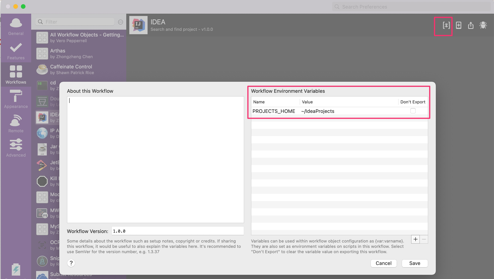

### alfred-idea-workflow
Using alfred to search and open idea project, without installing prepositive software.

### Background

There existed all kinds of alfred workflow, like [jetbrains-alfred-workflow](https://github.com/bchatard/jetbrains-alfred-workflow), but they are heavy, 

If use them, install all kinds of prepositive is necessary.

So the light alfred workflow without installing heavy dependency is written.

### Install

* Download and install alfred workflow.
    * [click to download](https://raw.githubusercontent.com/chenzz/alfred-idea-workflow/master/IDEA.alfredworkflow)
* Config project directory root path
    * ignore this step, if your project directory root path is `~/IdeaPorjects`
    * 

### Usage 

* Press `cmd+shift+i` to open input box
* Input project key word, search and open

